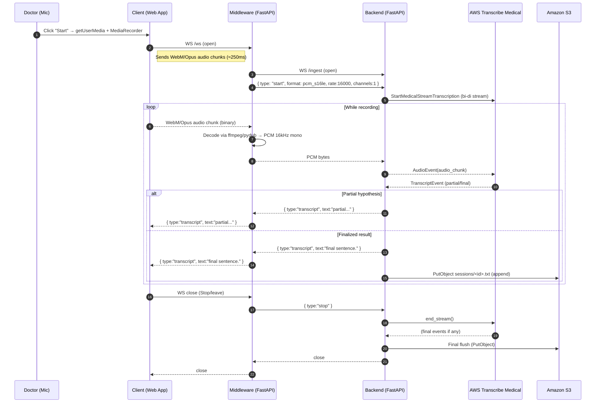
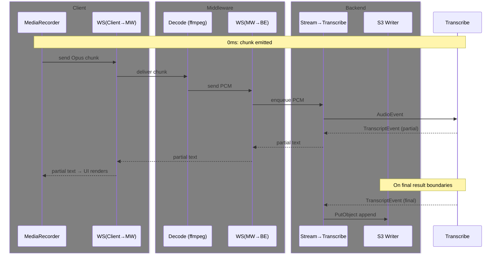

# Medical Transcription POC

Real-time medical speech-to-text using **Docker**, **WebSockets**, and **AWS Transcribe Medical** with **S3** persistence.

## Architecture

```
[Doctor’s Browser]
      │
      ▼
[Client Container: Web App]
      │ WebSocket (binary audio chunks)
      ▼
[Middleware Container: Audio Processor]
      │ WebSocket (PCM audio frames)
      ▼
[Backend Container: AWS Transcribe Medical]
      │ AWS Streaming API (bi-directional)
      │
      ├──> [Real-time Transcript to Client]
      └──> [Continuous Transcript Save to S3]
```

### Sequence Diagram (Mermaid)



### Timing View (Mermaid)



## How it works (summary)

1. **Client** captures mic audio (WebM/Opus) and streams via WebSocket.
2. **Middleware** converts Opus → **PCM 16kHz mono** using ffmpeg/pydub; forwards to Backend.
3. **Backend** streams PCM to **AWS Transcribe Medical** and relays partial/final transcripts back.
4. **S3** stores a continuously updated text file per session in `sessions/<id>.txt`.

## Quickstart

```bash
cp .env.example .env
# Fill AWS credentials and your S3 bucket
docker compose up --build

# In another terminal (optional): provision infra
cd infra
terraform init
terraform apply -var="bucket_name=<your-bucket>"
```

Open **http://localhost:8080** → Start Recording → speak → see live transcript → check S3 `sessions/`.

## Configuration

- `AWS_REGION`: e.g. `ap-south-1`
- `S3_BUCKET_NAME`: your bucket name
- `TRANSCRIBE_MEDICAL_SPECIALTY`: `PRIMARYCARE`, `CARDIOLOGY`, etc.
- `TRANSCRIBE_MEDICAL_TYPE`: `DICTATION` or `CONVERSATION`

## Troubleshooting

### Browser / Client
- **Mic prompt never appears**: Use Chrome/Edge and `http://localhost` (secure context). Ensure no other app is capturing the mic.
- **No audio flowing**: Check console; verify `MediaRecorder` supports `audio/webm;codecs=opus`. Fallback to `audio/webm` is automatic.
- **CORS/WebSocket blocked**: All services run on `localhost` with open WS. If front-end is elsewhere, ensure WS URL and CORS are allowed.

### Middleware
- **`ffmpeg` errors**: The Docker image installs ffmpeg. If you changed base image, re-add `apt-get install -y ffmpeg`.
- **High CPU**: Audio decode/resample is CPU-bound. Increase container CPU shares or raise chunk size from 250ms to 400–500ms.

### Backend
- **`StartMedicalStreamTranscription` fails**: Verify region supports **Transcribe Medical**, and your IAM permissions include:
  - `transcribe:StartMedicalStreamTranscription`
- **No transcripts arriving**: Ensure your audio format is PCM 16kHz mono and the stream actually receives bytes (middleware logs).

### AWS / IAM / S3
- **AccessDenied (S3)**: Policy must include `s3:PutObject` and `s3:ListBucket` for the target bucket and `/*` objects.
- **Wrong bucket/region**: Bucket must exist in the same region as your AWS client config.
- **Credentials**: For local POC, `.env` can hold `AWS_ACCESS_KEY_ID`/`AWS_SECRET_ACCESS_KEY`. For prod, use IAM roles (IRSA/ECS).

### Networking
- **Can’t connect MW → Backend**: Compose service name `backend` is used as host. Keep `BACKEND_WS_URL=ws://backend:8082/ingest`.
- **Large frames**: If you see `max_size` errors, raise `max_size` in `websockets.connect` and ensure chunk sizes are reasonable.

### Latency tuning
- Lower `mediaRecorder.start(250)` to `150` or `100` ms for snappier partials.
- Ensure containers are not CPU-throttled; pin to performance profile if on laptop.

## Extensibility

- **Custom vocabulary**: Add `vocabulary_name` to the `StartMedicalStreamTranscriptionRequest`.
- **Speaker labeling**: For `CONVERSATION`, enable channel identification; for multi-person capture, you’ll need separate channels.
- **Storage**: Stream audio to S3 (e.g., HLS or raw PCM) alongside text if you need audio archives.
- **Observability**: Add structured logging and ship to CloudWatch/ELK.

---

© Your Team — POC build scaffolding
